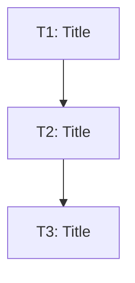

# Design to Plan

Transform technical design documents into detailed implementation plans with proper sequencing and blocking relationships. Outputs structured markdown that can be directly consumed by `linear-ticket-creator`.

## Goals

- Parse technical design documents (Linear docs, local markdown, or URLs)
- Analyze and identify discrete work items
- Determine blocking relationships between components
- Generate implementation plan with proper sequencing
- Output markdown file ready for ticket creation

## Prerequisites

For Linear URLs, the Linearis CLI tool must be installed:

```bash
npm install -g --install-links czottmann/linearis
```

Authenticate with your Linear API token:
- Save token to `~/.linear_api_token` file

## Input Formats

### Option 1: Linear Document URL
```
/design-to-plan https://linear.app/instruqt/document/technical-design-xyz
```

### Option 2: Local File Path
```
/design-to-plan /path/to/design.md
```

### Option 3: Linear Ticket URL
```
/design-to-plan https://linear.app/instruqt/issue/RAM-300
```

## Workflow

```
1. Read the design document
   ↓
2. Explore codebase for context
   ↓
3. Identify components and dependencies
   ↓
4. Generate implementation plan
   ↓
5. Present plan for user feedback
   ↓
6. Save plan to markdown file
```

## Instructions

### Phase 1: Read the Design Document

Determine the source type and read the content:

**Linear Document URL:**
```bash
# Parse URL to get document ID
# URL format: https://linear.app/{workspace}/document/{title}-{id}

curl -s -X POST "https://api.linear.app/graphql" \
  -H "Content-Type: application/json" \
  -H "Authorization: $(cat ~/.linear_api_token)" \
  --data-raw '{
    "query": "{ document(id: \"{DOC-ID}\") { id title content slugId creator { name } project { name id } createdAt updatedAt } }"
  }'
```

**Local Markdown File:**
```bash
# Read the file directly
Read /path/to/design.md
```

**Linear Ticket with Design:**
```bash
linearis issues read {IDENTIFIER}
# Check description and attachments for design content
```

### Phase 2: Explore Codebase for Context

Use Grep and Glob to understand:
- Existing patterns for similar features
- Which components/services are involved
- Dependencies between layers
- Code conventions and structure

Look for:
- Similar implementations to follow as patterns
- Shared utilities that can be reused
- Testing patterns used in the project

### Phase 3: Identify Components and Dependencies

Parse the design document to extract:

1. **Scope**: What systems/repos are affected
2. **Components**: Individual pieces of work
3. **Dependencies**: What must be done first
4. **Acceptance Criteria**: How to know when done

Identify natural split points based on **blocking relationships between components**:

```
✅ GOOD reasons to split:
- Component A change that blocks Component B change
- Backend change that blocks Frontend change
- Complex logic that needs focused attention
- Different repos/services involved

❌ BAD reasons to split:
- "Create proto file" → "Generate types" → "Implement handler"
- "Add component" → "Add unit tests"
- Mechanical code generation steps
```

### Phase 4: Generate Implementation Plan

Create a structured markdown file with this format:

```markdown
# Implementation Plan: {Title}

**Source:** {Linear URL or file path}
**Generated:** {date}

## Overview

{1-2 sentence summary of what we're implementing}

## Affected Systems

- {repo1}: {what changes}
- {repo2}: {what changes}

## Tickets

### T1: {Ticket Title}

**Labels:** {comma-separated labels}
**Component:** {Lab-SDK | Gozilla | Frontend | etc.}

{Description of what this ticket accomplishes}

#### Scope

- {Work item 1}
- {Work item 2}
- {Unit tests}

#### Acceptance Criteria

- [ ] {Criterion 1}
- [ ] {Criterion 2}

#### Dependencies

None

---

### T2: {Ticket Title}

**Labels:** {comma-separated labels}
**Component:** {component name}

{Description}

#### Scope

- {Work items}

#### Acceptance Criteria

- [ ] {Criteria}

#### Dependencies

- T1

---

{... more tickets ...}

## Sequence Diagram



## Parallelization Notes

{Which tickets can be worked on simultaneously}

## Risk Areas

{Potential issues to watch}

## Open Questions

{Questions that need answers before implementation, or "None"}
```

### Phase 5: Present Plan for User Feedback

Show a summary to the user:

```markdown
## Implementation Plan Summary

| # | Title | Component | Dependencies |
|---|-------|-----------|--------------|
| T1 | Add Protobuf Enums | Backend | None |
| T2 | Add Protobuf Messages | Backend | T1 |
| T3 | Frontend Integration | Frontend | T2 |

**Total tickets:** 3
**Blocking relations:** T1 → T2 → T3
**Parallelizable:** T1 can start immediately
```

Use AskUserQuestion to get feedback:
- Approve the plan
- Request modifications
- Ask clarifying questions

### Phase 6: Save Plan to File

Save the final plan to a markdown file:

```bash
# Save to a location the user specifies, or default
Write /path/to/output/implementation-plan.md
```

Tell the user:
```
Implementation plan saved to: /path/to/output/implementation-plan.md

To create tickets in Linear, run:
/linear-ticket-creator /path/to/output/implementation-plan.md
```

## Bundling Guidelines

### What Goes in ONE Ticket

Bundle together:
- Proto/type definitions AND their implementation
- Component AND its tests
- Schema changes AND the code using them
- All mechanical generation steps

### When to Split

Split when:
- Different components/repos involved
- Clear blocking relationship exists
- Complex business logic needs focused attention
- Different team ownership

## Sizing Guidelines

| Size | Description | When to Split |
|------|-------------|---------------|
| S | Single focused change, minimal complexity | Don't split further |
| M | Multiple related changes, moderate complexity | Consider splitting if has distinct blocking phases |
| L | Significant scope, multiple components touched | Split by component boundary or complexity |
| XL | Large scope, high complexity | Must split into smaller tickets |

## Handling Missing Information

- **Unknown technical approach**: Note as open question, suggest investigation ticket
- **Unclear requirements**: List as open question
- **External dependency unclear**: Note as risk area

Never block the entire plan on missing information - note gaps and proceed.

## Integration with Other Skills

After creating the plan, use:

- **linear-ticket-creator**: Create tickets in Linear from the plan
- **linear-investigator**: If requirements need clarification first
- **implementation-orchestrator**: After tickets are created, to implement them

## Error Handling

### Design Doc Not Found
```
Error: Could not read design document at {path/url}
Please verify the path is correct and you have access.
```

### Unclear Work Breakdown
If the design doesn't clearly specify work items:
1. Ask user for clarification
2. Suggest a breakdown based on affected systems
3. Let user confirm or modify

## When to Use

Use `design-to-plan` when:
- You have a technical design document ready
- You need to plan implementation before creating tickets
- You want to review the work breakdown before committing to Linear

For direct ticket creation without planning review, use `linear-ticket-creator` directly.
