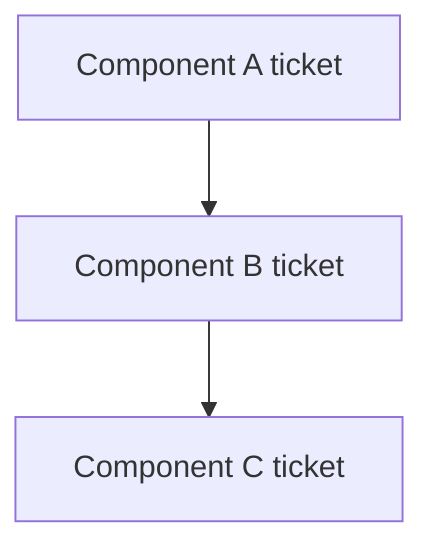
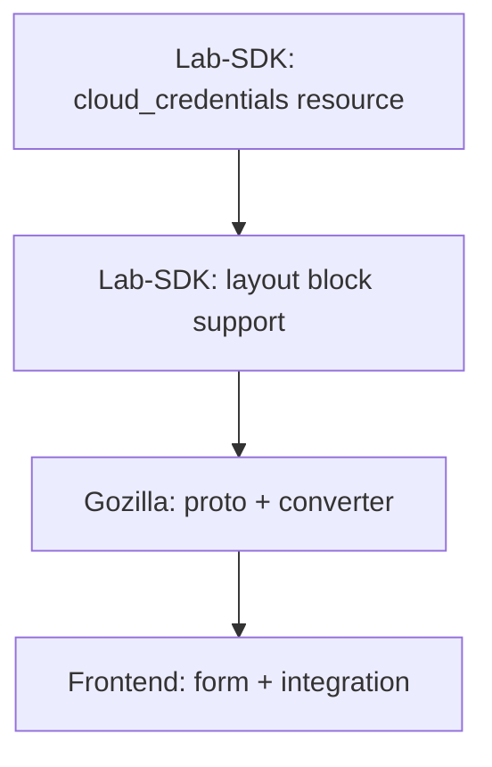

# Ticket Breakdown Skill

This skill analyzes technical designs, Linear tickets, or documents and breaks them down into sequenced work items based on blocking relationships between components.

## Goals

- Break work into tickets based on **blocking relationships** between components
- Focus on sequencing rather than arbitrary granularity
- Keep mechanical steps (type generation, schema updates) bundled with implementation
- Enable parallel work where components don't block each other

## Input Sources

This skill accepts:
1. **Local markdown file** - Technical design docs, requirements documents
2. **Linear ticket URL** - `https://linear.app/{workspace}/issue/{ID}/...`
3. **Linear document URL** - `https://linear.app/{workspace}/document/{ID}/...`

## Prerequisites

For Linear URLs, the Linearis CLI tool must be installed:

```bash
npm install -g --install-links czottmann/linearis
```

Authenticate with your Linear API token:
- Set `LINEAR_API_TOKEN` environment variable, OR
- Save token to `~/.linear_api_token` file

## Instructions

### 1. Load the Source Document

**For local markdown file:**
```bash
# Read the file directly
Read {file_path}
```

**For Linear ticket URL:**
```bash
# Extract identifier from URL: https://linear.app/{workspace}/issue/{IDENTIFIER}/...
linearis issues read {IDENTIFIER}
```

**For Linear document URL:**
```bash
# Extract document ID from URL: https://linear.app/{workspace}/document/{DOC-ID}/...
curl -s -X POST "https://api.linear.app/graphql" \
  -H "Content-Type: application/json" \
  -H "Authorization: $(cat ~/.linear_api_token)" \
  --data-raw '{
    "query": "{ document(id: \"{DOC-ID}\") { id title content } }"
  }'
```

### 2. Analyze the Work

Understand:
- **Scope**: What is being built end-to-end?
- **Components involved**: Which services/repos need changes?
- **Blocking relationships**: What must be done before what?
- **Complexity hotspots**: Where is the intricate logic?

### 3. Explore the Codebase

Use Grep and Glob to understand:
- Existing patterns for similar features
- Which components/services are involved
- Dependencies between layers

### 4. Identify Natural Split Points

Split tickets where there are **blocking relationships between components**:

```
✅ GOOD reasons to split:
- Lab-SDK change that blocks Gozilla change
- Gozilla change that blocks Frontend change
- Complex repository layer that blocks service layer
- Intricate business logic that needs focused attention

❌ BAD reasons to split:
- "Create proto file" → "Generate types" → "Implement handler"
- "Add component" → "Add unit tests"
- Mechanical code generation steps
```

### 5. Create Work Items

Create tickets based on component boundaries and blocking relationships.

#### What Goes in ONE Ticket

Bundle together:
- Proto/type definitions AND their implementation
- Component AND its tests
- Schema changes AND the code using them
- All mechanical generation steps

#### Ticket Types

**Component/Service tickets:**
```markdown
### [Lab-SDK] Add cloud_credentials resource
**Description:** Implement the cloud_credentials HCL resource with parsing and validation
**Scope:**
- Resource struct definition
- HCL parsing
- Validation logic
- Register resource
- Unit tests
**Blocks:** Gozilla converter implementation
```

**Complex business logic tickets:**
```markdown
### [Gozilla] Implement cloud credentials converter
**Description:** Proto ↔ domain conversion for cloud credentials
**Scope:**
- Proto definition (cloud_credentials.proto)
- Domain model
- Converter functions (FromProto, ToProto)
- Add to resources.proto
- Unit tests
**Blocked by:** Lab-SDK resource
**Blocks:** Frontend integration
```

**Frontend feature tickets:**
```markdown
### [Frontend] Cloud credentials form and layout integration
**Description:** Form for creating/editing cloud credentials and layout integration
**Scope:**
- Resource management (create/update/delete)
- Layout block parsing
- Form component with validation
- Integration tests
**Blocked by:** Gozilla converter
```

**Investigation tickets (when needed):**
```markdown
### [SPIKE] Investigate storage approach for X
**Description:** Research and recommend approach
**Questions to Answer:**
- Option A vs Option B trade-offs?
- Performance implications?
**Deliverable:** Decision documented
**Blocks:** Implementation tickets
```

### 6. Output Format

Generate markdown in this structure:

```markdown
# Ticket Breakdown: {Title}

**Source:** {Linear URL or file path}

## Overview

{1-2 sentence summary of what's being built}

## Work Items

{Tickets organized by sequence/blocking order}

### {Ticket Title}
**Component:** {Lab-SDK | Gozilla | Frontend | etc.}
**Description:** {What this ticket accomplishes}
**Scope:**
- {Bundled work item 1}
- {Bundled work item 2}
- {Tests}
**Blocked by:** {Dependencies, if any}
**Blocks:** {What this unblocks}

## Sequence Diagram



## Parallelization Notes

{Which tickets can be worked on simultaneously}

## Open Questions

{Questions that need answers before implementation}
```

### 7. Sizing Guidelines

| Size | Description | When to Split |
|------|-------------|---------------|
| S | Single focused change, minimal complexity | Don't split further |
| M | Multiple related changes, moderate complexity | Consider splitting if has distinct blocking phases |
| L | Significant scope, multiple components touched | Split by component boundary or complexity |
| XL | Large scope, high complexity | Must split into smaller tickets |

### 8. When to Split vs Bundle

**Split when:**
- Different components/repos involved (Lab-SDK vs Gozilla vs Frontend)
- Clear blocking relationship exists
- Complex business logic needs focused attention
- Repository layer has non-trivial queries

**Bundle when:**
- Proto definition + implementation + tests in same component
- Schema changes + code using them
- Component + its unit tests
- Mechanical code generation steps

### 9. When Information is Missing

- **Unknown technical approach**: Create investigation ticket
- **Unclear requirements**: List as open question
- **External dependency unclear**: Create investigation ticket

Never block the entire breakdown on missing information.

## Example Output

```markdown
# Ticket Breakdown: Cloud Credentials Authoring Flow

**Source:** /Users/victor/Documents/instruqt/think/cloud-credentials-authoring-design.md

## Overview

Implement the authoring flow for cloud credentials tabs, allowing lab authors to configure which cloud account credentials are displayed to users.

## Work Items

### [Lab-SDK] Add cloud_credentials resource
**Component:** Lab-SDK
**Description:** Implement the cloud_credentials HCL resource with parsing and validation
**Scope:**
- CloudCredentials struct with provider-specific blocks (aws_account, google_project, azure_subscription)
- HCL parsing for user/service account references
- Validation (at least one provider, valid references)
- Register resource
- Unit tests
**Blocks:** Gozilla implementation

---

### [Lab-SDK] Add cloud_credentials layout block
**Component:** Lab-SDK
**Description:** Add cloud_credentials block support to the layout resource
**Scope:**
- CloudCredentialsBlock struct with target reference
- Layout validation for cloud_credentials block
- Unit tests
**Blocked by:** cloud_credentials resource
**Blocks:** Gozilla implementation

---

### [Gozilla] Implement cloud credentials proto and converter
**Component:** Gozilla
**Description:** Proto definition and domain conversion for cloud credentials
**Scope:**
- cloud_credentials.proto with provider-specific messages
- Add to resources.proto
- Domain model (CloudCredentials, provider configs)
- Converter functions (FromProto, ToProto)
- Unit tests
**Blocked by:** Lab-SDK resources
**Blocks:** Frontend integration

---

### [Frontend] Cloud credentials form and integration
**Component:** Frontend
**Description:** Form for creating/editing cloud credentials and layout integration
**Scope:**
- Regenerate proto types
- Resource management (create/update/delete CloudCredentialsResource)
- Layout parsing for cloud_credentials block
- Connect existing form (RAM-23) to backend
- Integration tests
**Blocked by:** Gozilla proto/converter

## Sequence Diagram



## Parallelization Notes

- Lab-SDK resource and layout block can potentially be done together
- Frontend form UI (RAM-23) can proceed in parallel with backend work using mocks
- Once Gozilla is done, frontend integration can complete

## Open Questions

_None - design document is comprehensive_
```

## Notes

- Focus on blocking relationships, not arbitrary granularity
- Bundle proto + implementation + tests in same ticket
- Use component prefixes: [Lab-SDK], [Gozilla], [Frontend], [Lab-Agent], etc.
- This skill outputs markdown - use linear-ticket-creator to create tickets in Linear
